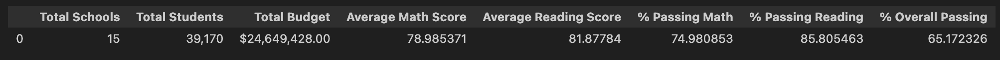
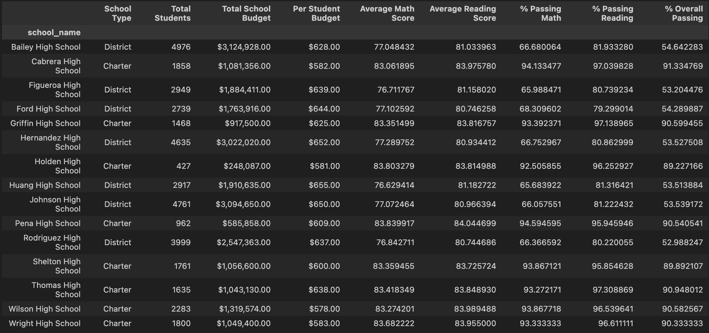
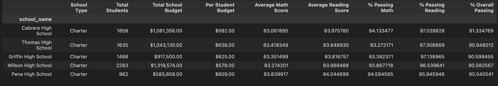
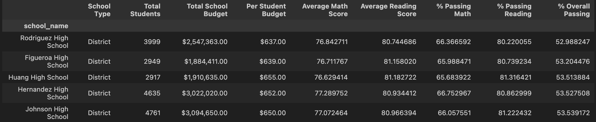
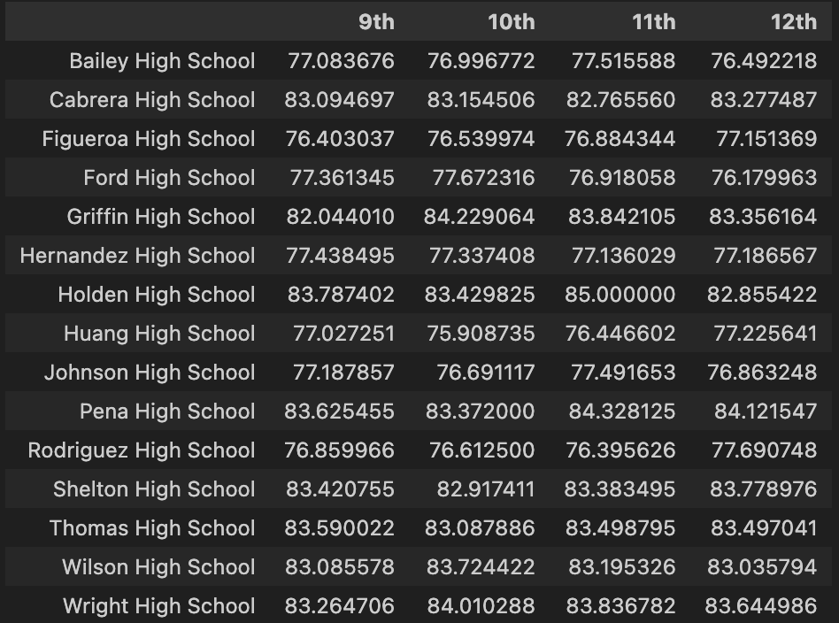
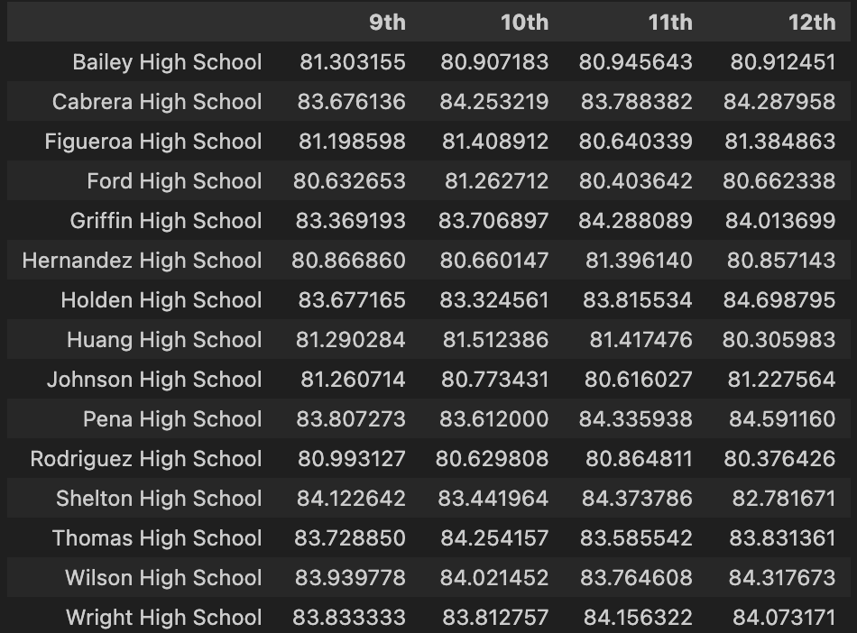
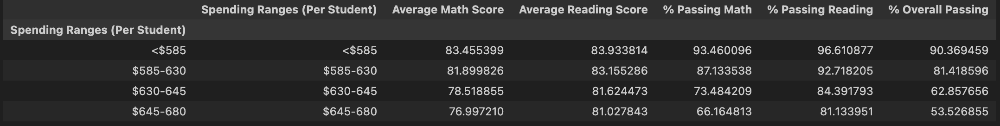
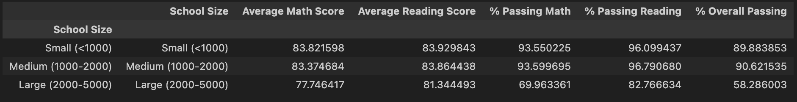
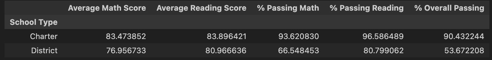

# PyCity School Analysis

## Overview

In this challenge, we analyze a school district’s standardized test scores and identify obvious trends in school performance to help the school board with their strategic planning. To do so, we look at the reading and math scores for every student across the 15 schools in the district. There are two datasets included in this analysis, “students_complete.csv” and “schools_complete.csv”. The “schools_complete.csv” dataset includes the basic school information split into the four columns: “School ID”, “school_name”, “type”, “size”(total # of students), and “budget”. The “students_complete.csv” contains the basic student information and their standardized test scores for both math and reading. The columns include: “Student ID”, “student_name”, “gender”, “grade”, “school_name”, “reading_score”, and “math_score”. These datasets are used to calculate the average test scores and the percentage of students passing (a score of 70 or higher is a passing grade). The data is then split into 7 buckets that allow us to identify key trends in school performance: District Summary, School Summary, Highest/Bottom Performing Schools (by % of Overall Passing), Scores by Grade, Scores by School Spending, Scores by Size, and Scores by School Type. 

## File Structure

Here's an overview of the file structure:

## File Structure

Here's an overview of the file structure:

     
## Instructions
    1. Clone the repository to your local device using git clone https://github.com/jackthomas1430/pandas-challenge.git
    2. Check that “students_complete.csv” and “schools_complete.csv” is located in the "Resources" folder
    3. Open ""PyCitySchools_Analysis.ipynb" 
    4. Run all cells
    
## Results 

## Summary/Analysis 

The summary results included in the report provide insight into three key factors that may potentially affect student performance: Size, Total Budget per Student, and School Type. In total, the PyCity school district has 39,170 students across 15 schools and a total budget of $24,649,428. Across the entire district, 75% of the students passed math with an average score of 79, while 86% of students passed reading with an average score of 82. Overall, 65% of the students passed. 

When the results are broken down by school size, the data suggests that the total number of students at a school may play an important role in performance. The average number of students at each school in the district is 2,611. Holden High School has the fewest at 427 students, and Bailey High School has the most at 4,976 students. The summary tables, “Highest Performing Schools (by % Overall Passing)” and “Bottom Performing Schools (by % Overall Passing)”, show that of the top 5 performing schools, only 1 school has more than 2,000 students, while all 5 of the bottom performing schools have more than 2,900 students. The “Scores by School Size” table places the schools into 3 groups: schools with less than 1,000 students (small), schools with 1,000-2,000 students (medium), and schools with 2,000-5,000 students (large). It shows that both the small and medium sized schools have much higher passing rates than the large schools. The drop off from 90% of students passing at small and medium sized schools to just 58% of students passing at large schools might indicate that once schools surpass more than 2,000 students their standardized test scores start to go down.   

It may be considered that schools with more than 2,000 students experience worse test results because their total budget per student is smaller. However, the data does not show that to be the case. Furthermore, there is no clear indication that schools with a higher budget per student have a more successful passing rate. The data shows the opposite. The district has an average budget of $620 per student, with a relatively small gap between the largest budget at $655 per student, and the smallest at $578 per student. The top performing school, Cabrera High School, which has an overall passing rate of 91%, has a budget of $582 per student, while all 5 of the bottom performing schools have a budget of more than $600 per student. Perhaps, this can be explained by the fact that the difference in spending across schools was minimal. However, it might also indicate that school structure and size are far bigger factors in student success than spending. 

Finally, the data clearly shows that “charter” schools performed far better than “district” schools. “Charter” schools have an overall passing rate of 90%, while “district” schools have an overall passing rate of just 54%. Furthermore, all five of the top performing schools in the district are “charter” schools, while all 5 of the bottom performing schools are “district” schools. A further examination of school types and why “charter” schools perform better than “district” schools could help guide many decisions moving forward. 

Ultimately, an evaluation of school type and size, and why these factors may lead to more successful standardized test scores should be a priority during strategic planning. 

## Acknowledgements
    
    Xpert Learning Assistant was used to answer detailed questions, and assist in debugging.The starter code provided was the base of the report and was modified using course curriculum and activities to fit the requirements of the assignment.For more information about the Xpert Learning Assistant, visit [EdX Xpert Learning Assistant](https://www.edx.org/). 

## References

Data for this dataset was generated by edX Boot Camps LLC

© 2022 edX Boot Camps LLC. Confidential and Proprietary. All Rights Reserved.
